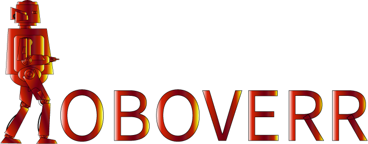

# RoboVerr

A dynamic robot shooting platform game with user authentication and score tracking.



## 🎮 Description

RoboVerr is an action-packed web-based shooting game featuring a robot protagonist navigating through platform challenges while battling enemies. The game includes user authentication, score tracking, and leaderboards to compete with other players.

## ✨ Features

- **Engaging Gameplay**: Navigate platforms, shoot enemies, and compete for high scores
- **User Authentication**: Login with Google account
- **Profile Management**: View and update your player profile
- **Leaderboards**: Compare your scores with other players
- **Responsive Controls**: Support for both keyboard and touch controls
- **Cross-platform**: Works on desktop and mobile devices
- **Progressive Web App**: Can be installed on supported devices

## 🚀 Live Demo

[Play RoboVerr Now](https://your-deployment-url.com)

## 📋 Prerequisites

- Node.js (v14.x or higher)
- MySQL database

## 🛠️ Installation

1. Clone the repository
   ```bash
   git clone https://github.com/yourusername/roboverr.git
   cd roboverr
   ```

2. Install dependencies
   ```bash
   npm install
   ```

3. Create a `.env` file in the root directory with the following variables:
   ```
   PORT=3000
   DB_HOST=localhost
   DB_USER=root
   DB_PASSWORD=yourpassword
   DB_NAME=roboverr
   JWT_SECRET=your_jwt_secret
   SESSION_SECRET=your_session_secret
   GOOGLE_CLIENT_ID=your_google_client_id
   GOOGLE_CLIENT_SECRET=your_google_client_secret
   GOOGLE_CALLBACK_URL=http://localhost:3000/auth/google/callback
   ```

4. Initialize the database
   ```bash
   # The database will be automatically initialized when you start the server
   ```

5. Start the development server
   ```bash
   npm run dev
   ```

6. Open your browser and navigate to `http://localhost:3000`

## 🎮 How to Play

1. **Movement**: Use arrow keys or on-screen touch controls
   - Left/Right: Move horizontally
   - Up: Jump

2. **Combat**:
   - Enter or shoot button: Fire weapon
   - Eliminate enemies to earn points

3. **Objective**:
   - Navigate through platforms
   - Defeat enemies
   - Achieve the highest score possible

## 🧩 Game Controls

### Keyboard Controls
- **Left Arrow**: Move left
- **Right Arrow**: Move right
- **Up Arrow**: Jump
- **Enter**: Shoot

### Touch Controls
- **Left Button**: Move left
- **Right Button**: Move right
- **Jump Button**: Jump
- **Shoot Button**: Fire weapon
- **Pause Button**: Pause game
- **Restart Button**: Restart game

## 👨‍💻 Technology Stack

- **Frontend**: HTML5, CSS3, JavaScript
- **Game Engine**: Custom JavaScript game engine (Canvas 2d)
- **Backend**: Node.js, Express
- **Database**: MySQL with Sequelize ORM
- **Authentication**: Google OAuth, JWT
- **View Engine**: EJS
- **Asset Management**: Custom asset loader

## 📝 License

This project is licensed under the MIT License - see the LICENSE file for details.

## 👤 Author

- **Adeniji Olajide** - [GitHub Profile](https://github.com/yourusername)

## 📞 Contact

If you have any questions or feedback, please reach out to:
- Email: adenijiolajid01@gmail.com
- Twitter: [@GoldenThrust3](https://x.com/Goldenthrust3)
- LinkedIn: [Adeniji Olajide](https://www.linkedin.com/in/olajide-adeniji/)

---

Made with ❤️